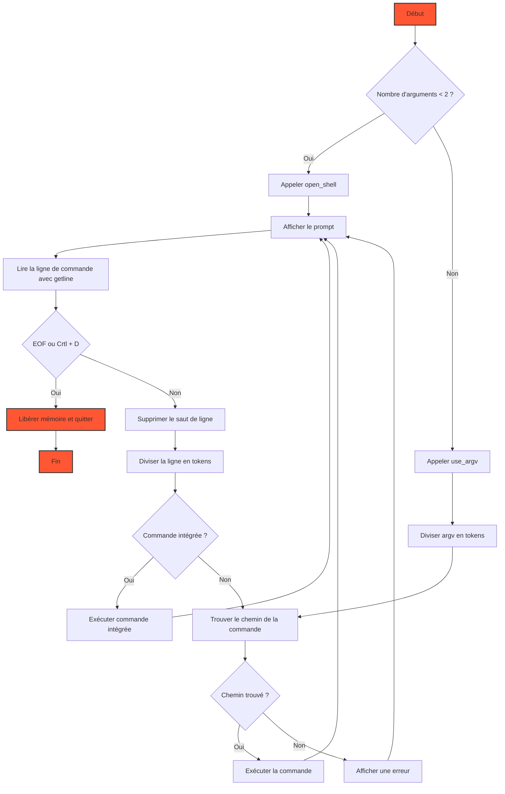

C - simple_shell

```mermaid
flowchart TD
    A[Début] --> B{Nombre d'arguments < 2 ?}
    B -- Oui --> C[Appeler open_shell]
    B -- Non --> D[Appeler use_argv]
    C --> E[Afficher le prompt]
    E --> F[Lire la ligne de commande avec getline]
    F --> G{EOF  ou Crtl + D}
    G -- Oui --> H[Libérer mémoire et quitter]
    G -- Non --> I[Supprimer le saut de ligne]
    I --> J[Diviser la ligne en tokens]
    J --> K{Commande intégrée ?}
    K -- Oui --> L[Exécuter commande intégrée]
    K -- Non --> M[Trouver le chemin de la commande]
    L --> E
    M --> N{Chemin trouvé ?}
    N -- Oui --> P[Exécuter la commande]
    N -- Non --> Q[Afficher une erreur]
    P --> E
    Q --> E
    D --> R[Diviser argv en tokens]
    R --> M
    H --> S[Fin]

    classDef startEnd fill:#ff5733,stroke:#333,stroke-width:2px;
    class A,H,S startEnd;
```
